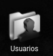
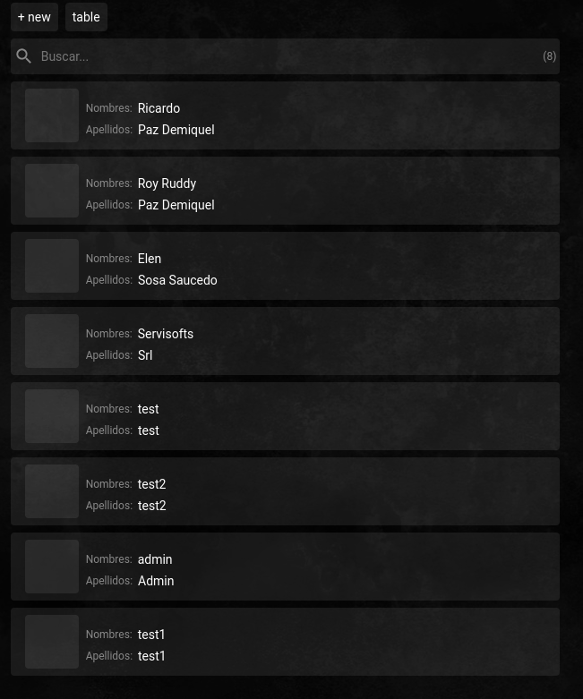
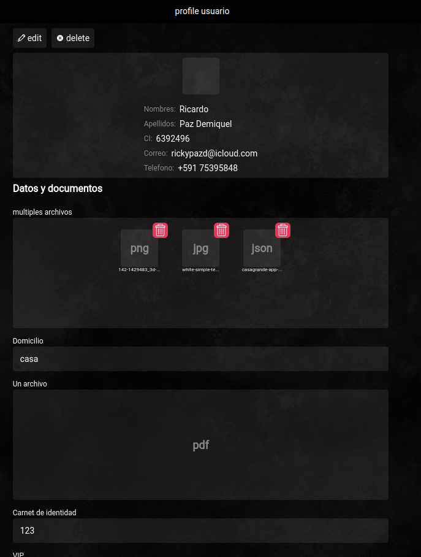
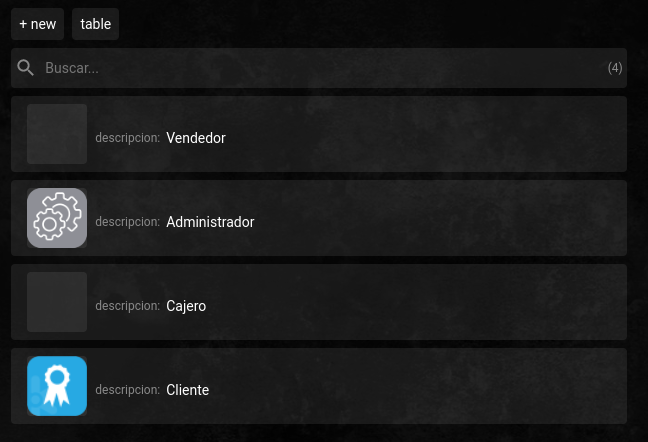
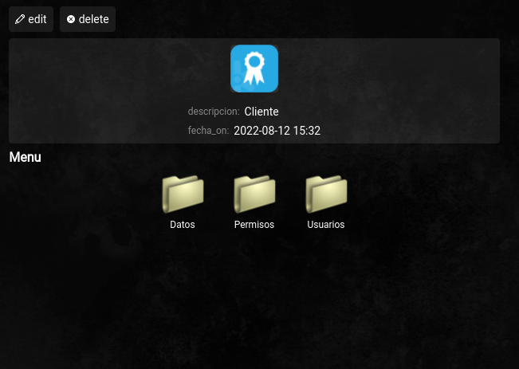

# Servisofts - Darmotos

## Introducción

Bienvenido al sistema de gestión de ventas de DarMotos

[darmotos.com](https://darmotos.servisofts.com)

El sistema integrado DarMotos cuenta con innumerables opciones para facilitar la gestion de la empresa.

Este sistema es una herramienta indespensable para lograr un manejo eficiente de la información.

### Tecnologías Aplicadas

- Figma, Framer
- HTML5, CSS 3, React-Native
- Java, Python, C#, JavaScript
- MySQL, Postgres, Oracle.
- Git, SVN, JSON.
- Linux server
- Estructura 

### Módulos

- Usuarios
- Roles y permisos
- Sucursales
- Clientes
- Bancos
- Almacenes
- Productos
- Compra
- Venta
- Cobranza

### Ahora te detallaremos cada módulo y como funciona actualmente en el sistema.
### Fecha actual 06-09-2022

En estos momentos el menu principal de la aplicación se ve de esta manera.

### A continuación intentaré detallar cada uno de los íconos.

## Ajustes

### Ingresando a Ajustes encontramos los siguientes íconos.

Datos del rol: Datos del rol es un lugar donde el Administrador de la aplicación podrá registrar los diferentes tipos de datos y documentos para asignar a los diferentes roles de las personas en la app.
(más adelante te explicaremos como manejamos los roles)

Al ingresar a este ícono verás el listado de todos los datos y documentos registrados por los administradores del sistema, como vemos en la siguiente imagen:

Dependiendo de nuestro nivel de permisos podremos crear nuevos datos y documentos, editar los actuales, eliminar y ver en forma de tabla para exportar a excel.

Los campos necesarios para un Dato o documento son los siguientes:

- Descripcion: Nombre a mostrar del dato o documento.
- Observación: Una explicación breve del dato o documento.
- Tipo: El tipo de dato a solicitar, puede ser un número, un texto, una fecha, imagen, documento, ect...
- Requerido: Al momento de guardar los datos solicitados si este campo es requerido no y lo dejan en blanco el sistema dará una advertencia.
- Caducable: Son daatos o documentos que caducan en el tiempo como la cédula de identidad.

White: Podria aparecerte tanto un sol y white como una luna y dark, que son las dos tonalidades de las aplicaciones de Servisofts Srl. el modo claro y el modo Obscuro.

## Bancos: 

El módulo de bancos es un módulo indespensable para la tesorería de la empresa, en este módulo recahen todos los movimientos financieros de la aplicación, en primera instancia podemos listar y crear los diferentes bancos con los que trabajamos.

Al ingresar a un banco podremos gestionar las cuentas que tenemos en el mismo.

Al ingresar a una cuenta podremos ver todos los movientos y el porque de cada moviento, esto para tener un mejor control de los movimientos bancarios y al mismo tiempo porque existen muchos eventos adentro de la app que terminan haciendo un movimiento en nuestro banco entonces en esa glosa sabremos el motivo del movimiento.

### Ingresando a Bancos encontramos los siguientes íconos.

## Usuarios:

 - Para llevar una buena gestion de lo que ocurre en un software
   informático es indispensable el desarrollo de un módulo de
   registro, edición, bloqueo, baja y seguimientos de usuarios.
    
    
   En este caso el usuario administrador ingresa al apartado usuarios:
    
   
    
    
   Al ingresar odrá ver un listado de los usuarios del sistema y si tiene los respectivos permisos, 
   podra crear nuevos y ver en forma de tabla.
    
    
              
   
            
   Al seleccionar un usuario podrá dirigirse hasta su perfil, donde podra cambiar su foto, y su respectiva información segun su rol en el sistema,
   ya se una cliente, un empleado un administrador o alguno otro nuevo creado por alguna necesidad futura.
    
    
   
    
    
   
   
## Roles y permisos:

 - Una vez registrados los usuarios, es necesario asignarle uno o mas roles para gestionar sus 
   permisos de acceso a las diferentes funcionalidades del
   sistema. Por esto se desarrolla un módulo de roles y permisos
   para los usuarios.
   
    
   
   
   
       
   
   al igual que los usuarios lo primero en ver será la lista y las opciones de crear.
   
       
   
   
   
       
   
   Al seleccionar un rol ingresará a su panel administrativo donde podrá:
    
    - Editar
    - Eliminar
    - Datos y documentos
    - Usuarios que tienen el rol
    - Permisos del rol
   
   
   
    
    
   
    
    

## Authors

- Servisofts Srl.
